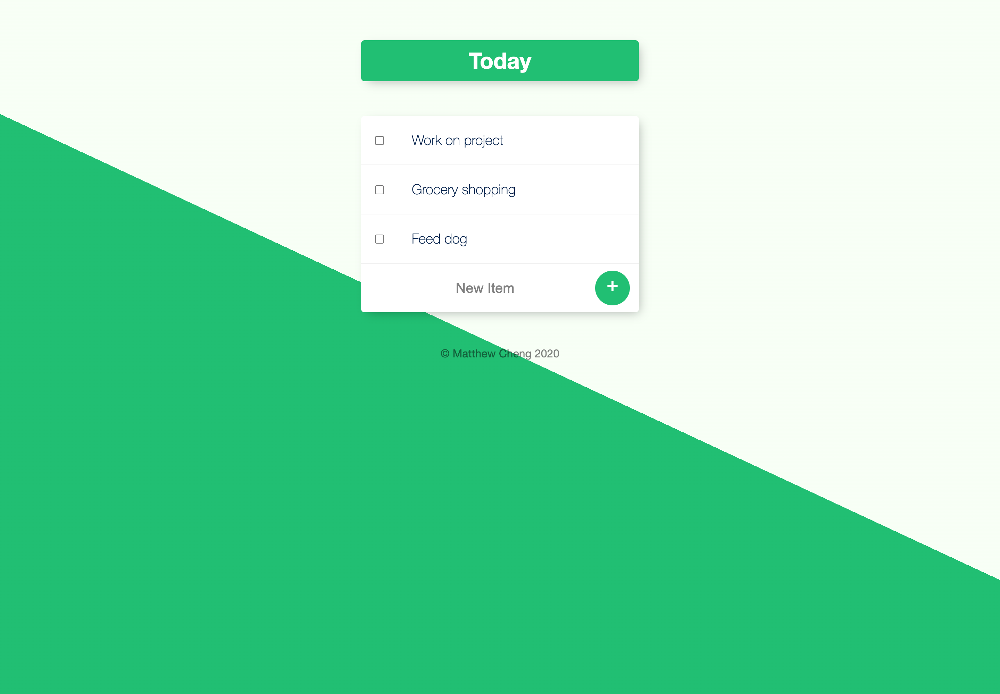
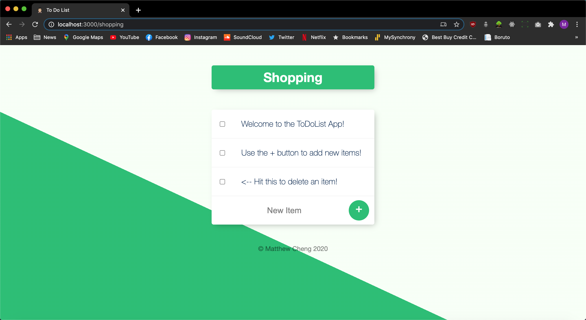

# TodoList App

The TodoList app helps you keep track of all the things you need to do. You can also make custom lists based on your different needs.

[LIVE DEMO](https://damp-cove-27024.herokuapp.com/)

## Installation

After downloading the code, cd into the file location and run this in the terminal to get the app running locally.

```bash
todolistv2 $ node app.js
```

## Usage

To add an item to the list, simply type in a new item and then hit the "+" button. To delete and item, hit the check box next to the item you wish to delete.



To create a new list, go into your web browser and add the title for your new list in the link.

```python
Ex) localhost:3000/shopping
```



## Tech Stack
* HTML5
* CSS3
* JavaScript
* Node.JS
* MongoDB

## Contributing
Pull requests are welcome. For major changes, please open an issue first to discuss what you would like to change.

Please make sure to update tests as appropriate.